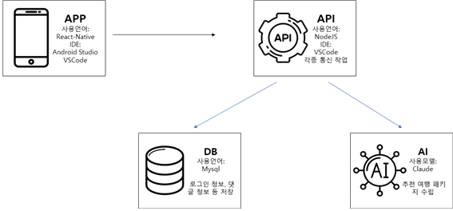

### 캡스톤 프로젝트 2025 (백엔드)

* 목적

  1. 프로젝트 정의
      *  문화 생활을 포함한 여행 계획을 수립하는 여행 플래너 (with AI)
  2. 프로젝트 배경
      *  점점 여행을 가고 싶어 하는 사람이 늘어나고 있다. 또한, 그들은 효율적인 여행을 기획하고, 기대하고 있다. GLOBE 팀이 개발하는 'Culture & Trip' 애플리케이션을 통해 많은 사람들이 원하는 바를 이룰 수 있는 뜻깊은 여행을 즐길 수 있게 만들고 싶다.
  3. 프로젝트 목표
      * 가. 지역 선택에 따른 패키지 추천
        - 사용자가 원하는 여행지와 날짜를 선택하면, 그 장소와 일정에 맞는 패키지를 추천하도록 구현

      * 나. AI를 활용한 패키지 추천
        - 사용자가 원하는 공연을 포함하는 여행일정을 AI의 API를 이용하여 수립한 뒤, 사용자에게 표출되도록 구현
* 개요

  1. 프로젝트 설명
      * 여행을 하고 싶은 국가 혹은 지역을 선택하면, 해당 위치에서 열리는 문화 생활(콘서트, 뮤지컬, 스포츠 등)을 포함하고 있는 패키지 여행을 추천해준다. 또한, AI를 활용하여 사용자가 원하는 여행 목적을 전달하면 그에 맞는 여행 패키지가 자동으로 생성된다.
  2. 프로젝트 구조
       
  3. 시나리오
      * 지역 선택에 따른 패키지 추천
          1. 사용자가 여행지로 원하는 지역을 선택하여 서버 전송
          2. 서버에서 조건을 통한 여행 패키지 리스트 리턴
          3. 사용자가 관람하고 싶은 공연 장르 선택
          4. 서버에서 조건에 맞는 여행 패키지 추천
      * AI를 활용한 패키지 추천
          1. 사용자가 AI에게 원하는 여행 목표를 전달
          2. 서버에서 해당 목표를 토대로 AI의 여행 패키지 생성
          3. 사용자가 조건을 추가하여 최종적으로 원하는 여행 패키지 수립